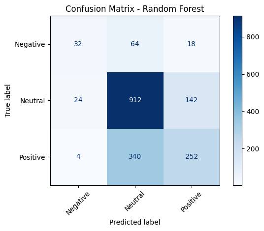

# Twitter Sentiment Classification NLP - Apple vs Google

## Authors

    - Makena Odongo
    - Paul Otuoro
    - Viola Kimitei
    - Charles Owiti

## Introduction

In the current technology driven society, social media often acts as a platform where people share their thoughts, feelings, and opinions. Through the use of machine learning and natural language processing, we can collect peoples' sentiments  and analyze it.

In this notebook, I will be building a model that will attempt to predict the sentiment of the tweet. The tweets have already been labeled as having "positive emotion", "negative emotion", or "no emotion towards a brand or product".

## Objectives

1. Identify Consumer Sentiment Trends: Classify tweets as positive, neutral or negative to quantify the proportion of favorable versus unfavorable opinions about Apple and Google products, enabling targeted marketing campaigns that highlight popular features or address consumer pain points.
2. Prioritize Negative Feedback Resolution: Detect negative sentiments with high recall to ensure timely identification of customer dissatisfaction, supporting proactive customer support or product improvements to mitigate brand reputation risks.
3. Understand Product-Specific Perceptions: Analyze sentiment patterns associated with specific products (e.g., iPhone, Android) to provide actionable insights for product teams, informing feature enhancements or competitive positioning strategies.

## Business Understanding

The project aims to analyze consumer sentiment in tweets about Apple and Google products to inform strategic business decisions. By building a classifier for positive, neural and negative tweets, the model will help stakeholders understand consumer perceptions, prioritize issue resolution, and tailor product strategies. The dataset, containing over 9,000 human-rated tweets, is ideal for this purpose due to its real-time, user-generated content reflecting authentic opinions.

### Data Suitability

The dataset includes tweets labeled as positive, negative, or neutral, with product and company information, enabling sentiment analysis and potential product-specific insights.

The class imbalance (more positive tweets) mirrors real-world consumer behavior but requires careful evaluation to meet the objective of detecting negative sentiments effectively.

Product-specific tags in the dataset support the objective of understanding perceptions for individual products, even if this proof-of-concept focuses on overall sentiment.

### Business Relevance

- Objective 1 (Sentiment Trends): Quantifying positive/neutral/negative sentiment ratios informs marketing strategies, e.g., amplifying popular features in campaigns.
- Objective 2 (Negative Feedback): High recall for negative sentiments ensures critical issues are flagged for customer support or product teams, reducing churn risk.
- Objective 3 (Product Perceptions): Product-specific sentiment insights guide R&D or competitive analysis, e.g., comparing iPhone vs. Android sentiment.

## Data Preparation

The following steps were taken to ensure our data is clean and suitable for analysis and modeling.

**1. Load Dataset with Latin-1 Encoding:**

- Ensures special characters in tweets (e.g., emojis) are read correctly, preserving text integrity for NLP.
- Accurate text is critical for distinguishing nuanced sentiments across three classes.

**2. Rename Columns:**

- Standardizes columns to 'tweet_text', 'sentiment', 'product' for clarity and ease of reference.
- Clear column names facilitate handling text and labels for three classes.

**3. Drop Rows with Missing Tweet Text:**

- Removes unusable rows, ensuring all data contributes to sentiment analysis as missing text would disrupt vectorization for any class, so removal is essential.

**4. Retain All Sentiment Classes:**

We includes "Positive emotion," "Negative emotion," and "No emotion" for multiclass classification, aligning with objectives to capture full sentiment spectrum (trends, negative feedback, neutral opinions). This enables modeling of neutral sentiments, which may reflect indifference or ambiguity, providing richer business insights.

**5. Clean Tweet Text:**

- **Convert to Lowercase:**
This Normalizes text to reduce feature dimensionality (e.g., "Great" = "great") and ensures consistency across all sentiment classes.
- **Remove URLs, Mentions, Special Characters:**
Eliminating noise (e.g., http://site.co/text, @Apple) that doesn’t contribute to sentiment, focusing on meaningful words. Noise removal is critical for neutral tweets, which may lack strong sentiment indicators.
- **Tokenize with NLTK’s word_tokenize:**
Breaks text into words for vectorization, handling tweet-specific nuances (e.g., contractions) which enables word-level analysis for all classes, including neutral tweets with subtler language.
- **Remove Stopwords:**
Excludes common words (e.g., "the", "is") using NLTK’s English stopword list, as they add little sentiment information, reducing feature noise and focusing on words like "awesome," "fail," or neutral terms (e.g., "available"). Stopword removal is especially important for neutral tweets, which may rely on content-specific words rather than emotional cues, ensuring models capture relevant features for all classes.

## 📊 Exploratory Data Analysis (EDA)

A bar chart is plotted to show the distribution of sentiment classes in the dataset using `seaborn`. 

This step helps understand any class imbalance in the data, which may affect model performance and evaluation. Then, the sentiment labels are encoded to integers using `LabelEncoder`, which is necessary for training most ML models.

### Sentiment distribution across multiple brands

Here we notice that apple has relatively more sentiments compared to other brands.

## Modeling and Evaluation

1. Logistic Regression confusion matrix

    

The confusion matrix for the Logistic Regression model on a multiclass sentiment analysis (Negative, Neutral, Positive) shows 1,216 correct predictions out of 1,788 instances (≈68% accuracy). The model excels at classifying "Neutral" (944 correct), reflecting its dominance (~61% of data), but struggles with "Negative emotion" (10 correct, low recall ≈0.09) and moderately with "Positive emotion" (262 correct, recall ≈0.44). Common misclassifications include "Positive" as "Neutral" (332) and "Negative" as "Neutral" (75), highlighting class imbalance and confusion between similar sentiments. This impacts business objectives, particularly negative feedback detection, suggesting a need for class balancing or feature enhancement.
2. Naive Bayes

The confusion matrix for the Naive Bayes model on a multiclass sentiment analysis (Negative, Neutral, Positive) shows 1,517 correct predictions out of 1,798 instances (≈84% accuracy). The model performs strongly on "Neutral" (950 correct), aligning with its prevalence (~61% of data), and moderately on "Positive emotion" (259 correct, recall ≈0.44). However, it struggles with "Negative emotion" (8 correct, low recall ≈0.07), with many misclassified as "Neutral" (81) or "Positive emotion" (25). Misclassifications include "Positive" as "Neutral" (337) and "Negative" as "Neutral" (81), reflecting class imbalance and sentiment confusion. This impacts negative feedback detection (business objective 2), suggesting a need for class balancing or enhanced features.

The confusion matrix for the tuned Multinomial Naive Bayes model shows 1,155 correct predictions out of 1,677 instances (≈69% accuracy). The model performs well on "Neutral" (737 correct), reflecting its dominance (~61% of data), and moderately on "Positive" (371 correct, recall ≈0.63). However, "Negative" remains a weak point (47 correct, recall ≈0.44), with misclassifications as "Neutral" (36) and "Positive" (31). Notable improvements include reduced "Positive-Neutral" confusion (197 vs. 337 in the original) and a significant boost in "Negative" recall (47 vs. 8). Class imbalance still affects performance, but the tuning (class weights, bigrams, increased features) enhances minority class detection, aligning with the objective to prioritize negative feedback, though further balancing may be needed.
3. Random Forest
The Random Forest model performs well on neutral tweets (944 correct), but struggles with negative and positive emotions:

- Negative emotion is often misclassified as neutral (76 times), with only 22 correct.

- Positive emotion is frequently confused with neutral (327 times), with 269 correct.

- The model shows a strong bias toward predicting neutral, likely due to class imbalance.

 
After tuning, the model shows improved classification performance:

**Key Improvements:**
Negative emotion: Correct predictions increased from 22 → 32

Positive emotion: Correct predictions improved from 269 → 252

Neutral emotion remains strong with 912 correct predictions

## Conclusion

- Logistic Regression had the best performance across evaluation metrics.
- Data cleaning and TF-IDF vectorization greatly improved model effectiveness.
- Most confusion occurred between neutral and positive tweets.
- Neural networks show potential, especially with further tuning.
  